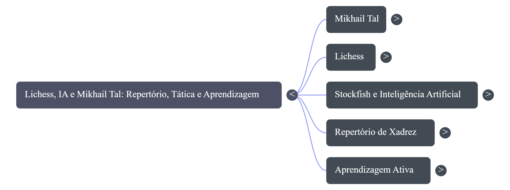

# Lichess, IA e Mikhail Tal: repertório, tática e aprendizagem ativa no xadrez

## 1. Contexto do Projeto

Este projeto foi desenvolvido como parte de um desafio prático da DIO no Bootcamp Bradesco. O objetivo foi criar um caderno temático de estudos utilizando o NotebookLM como ferramenta de apoio à aprendizagem ativa.

O tema escolhido foi a relação entre Lichess, Inteligência Artificial, motores de xadrez e o estilo criativo de Mikhail Tal. A escolha do tema surgiu do meu interesse pessoal pelo xadrez, jogo que pratico desde os 12 anos, e da curiosidade em entender como ferramentas modernas podem apoiar o estudo de repertório, tática e tomada de decisão.

Mikhail Tal ficou conhecido por seu estilo agressivo, criativo e baseado em sacrifícios. Ao mesmo tempo, plataformas como o Lichess e motores como o Stockfish permitem analisar partidas com grande precisão, revisar erros e comparar decisões humanas com avaliações computacionais.

A proposta deste estudo foi investigar como a IA pode ajudar um jogador amador a estudar xadrez de forma mais ativa, crítica e organizada.

---

## 2. Objetivos de Estudo

Os principais objetivos deste caderno temático foram:

* Entender quem foi Mikhail Tal e por que seu estilo é associado à criatividade, ataque e sacrifícios.
* Compreender como o Lichess pode ser usado como ferramenta de estudo e revisão de partidas.
* Analisar como motores de xadrez, como o Stockfish, avaliam decisões e sacrifícios.
* Refletir sobre os limites da avaliação objetiva dos motores diante da pressão prática em partidas humanas.
* Relacionar o estilo de Tal com construção de repertório, temas táticos e aprendizagem ativa.
* Testar recursos do NotebookLM, como perguntas orientadas, resumo em áudio no formato debate e mapa mental.
* Documentar prompts, dificuldades e aprendizados no processo.

---

## 3. Curadoria de Fontes

As fontes selecionadas para o NotebookLM foram escolhidas por apresentarem diferentes perspectivas sobre o tema: biográfica, prática, técnica e analítica.

### Fonte 1 — Lichess Features

**Link:** https://lichess.org/features

Fonte utilizada para compreender os recursos do Lichess, incluindo análise de partidas, estudos, revisão de erros e uso de motor de xadrez.

### Fonte 2 — Lichess Accuracy Metric

**Link:** https://lichess.org/page/accuracy

Fonte utilizada para entender a métrica de acurácia do Lichess, que compara a qualidade dos lances jogados com avaliações de motor.

### Fonte 3 — World Chess Hall of Fame: Mikhail Tal

**Link:** https://worldchesshof.org/inductee/mikhail-tal/

Fonte biográfica sobre Mikhail Tal, seu título mundial, estilo de jogo e importância histórica para o xadrez.

### Fonte 4 — FIDE / Open Chess Museum: Mikhail Tal

**Link:** https://museum.fide.com/champions/mikhail-tal

Fonte institucional sobre a carreira de Mikhail Tal, sua trajetória e seu legado como campeão mundial.

### Fonte 5 — Lichess Blog: How Correct Were Mikhail Tal’s Sacrifices?

**Link:** https://lichess.org/@/FischyVishy/blog/how-correct-were-mikhail-tals-sacrifices-part-1/H742llMG

Fonte utilizada para conectar o estilo sacrificial de Tal com análises modernas por motor, discutindo se seus sacrifícios eram objetivamente corretos ou se tinham força prática sobre o adversário humano.

---

## 4. Engenharia de Prompts e Cicatrizes

Durante o uso do NotebookLM, foram testadas perguntas e comandos para extrair respostas mais úteis, organizadas e críticas.

### Prompt 1 — Entendimento inicial

**Prompt usado:**

```text
Explique quem foi Mikhail Tal e por que seu estilo de jogo é associado à criatividade, ataque e sacrifícios no xadrez.
```

**Objetivo:**
Obter uma visão introdutória sobre Tal e seu estilo.

**Cicatriz / dificuldade encontrada:**
A resposta inicial ficou muito biográfica. Para melhorar, foi necessário pedir conexão direta entre estilo de jogo, sacrifícios e aprendizagem prática.

---

### Prompt 2 — Lichess e Stockfish como ferramentas de estudo

**Prompt usado:**

```text
Com base nas fontes, explique como o Lichess e o Stockfish podem ser usados para estudar partidas e revisar decisões no xadrez.
```

**Objetivo:**
Entender como a tecnologia atual pode apoiar a revisão de partidas.

**Cicatriz / dificuldade encontrada:**
A resposta inicial tratou o Lichess apenas como plataforma de jogo. Foi necessário reforçar o foco em análise, acurácia, estudos e revisão de erros.

---

### Prompt 3 — Sacrifícios de Tal e análise por motor

**Prompt usado:**

```text
Explique como a análise moderna por motores pode ajudar a entender os sacrifícios de Mikhail Tal. A ideia é descobrir se os sacrifícios eram sempre corretos ou se funcionavam também por pressão prática sobre o adversário.
```

**Objetivo:**
Comparar avaliação objetiva do motor com fatores humanos, como iniciativa, complexidade e pressão psicológica.

**Cicatriz / dificuldade encontrada:**
Algumas respostas tendiam a valorizar demais a avaliação do motor. Foi necessário pedir uma análise equilibrada entre precisão computacional e dificuldade prática para o adversário humano.

---

### Prompt 4 — Mapa mental

**Prompt usado:**

```text
Crie um mapa mental sobre o tema: Lichess, IA e Mikhail Tal: estudo de repertório, tática e aprendizagem ativa no xadrez.

Organize o mapa mental em cinco blocos principais: Mikhail Tal, Lichess, Stockfish e Inteligência Artificial, Repertório de Xadrez e Aprendizagem Ativa.
```

**Objetivo:**
Organizar visualmente as conexões principais do tema.

**Cicatriz / dificuldade encontrada:**
O mapa mental ajudou a simplificar o tema, mas exigiu uma organização prévia dos blocos para que o resultado não ficasse genérico.

---

### Prompt 5 — Áudio no formato debate

**Prompt usado:**

```text
Debata como o estilo criativo e sacrificial de Mikhail Tal pode ser estudado hoje com Lichess, Stockfish e ferramentas de IA.

Um apresentador deve defender que os motores modernos ajudam a revelar a precisão real dos sacrifícios de Tal, separando genialidade de risco objetivo.

O outro apresentador deve defender que a força de Tal não pode ser medida apenas pela avaliação fria do motor, porque seus sacrifícios criavam pressão prática, iniciativa, medo, complexidade e dificuldades humanas para o adversário.

Conectem o debate com aprendizagem ativa, repertório de xadrez, análise de partidas, acurácia no Lichess e uso crítico da IA por jogadores amadores.
```

**Objetivo:**
Gerar um debate em áudio com duas perspectivas sobre IA, motores de xadrez e o estilo de Tal.

**Cicatriz / dificuldade encontrada:**
O áudio gerado ficou longo, com mais de 23 minutos. Foi necessário comprimir o arquivo para conseguir adicioná-lo ao repositório GitHub.

---

## 5. Experimentos no NotebookLM

Além das perguntas feitas no chat do NotebookLM, também foram testados recursos do painel Estúdio.

### 5.1 Resumo em Áudio — Debate

Foi gerado um resumo em áudio no formato **Debate**, comparando duas visões:

1. A visão objetiva dos motores modernos, como o Stockfish, que avaliam a precisão dos lances.
2. A visão prática do estilo de Mikhail Tal, baseado em iniciativa, sacrifícios, pressão psicológica e complexidade humana.

O áudio original teve mais de 23 minutos e foi comprimido para ser incluído no GitHub.

**Arquivo:** [Ouvir áudio do debate](./assets/audio-debate-notebooklm.mp3)

### 5.2 Mapa Mental

Também foi gerado um mapa mental para organizar as conexões entre Mikhail Tal, Lichess, Stockfish, Inteligência Artificial, repertório de xadrez e aprendizagem ativa.



---

## 6. Miniguia de Estudo

### 6.1 Resumo Estruturado

O estudo mostra como o xadrez pode ser usado para compreender melhor a relação entre inteligência humana e inteligência artificial. Mikhail Tal representa um tipo de inteligência criativa, intuitiva e agressiva, marcada por sacrifícios e pressão prática. Já ferramentas modernas como Lichess e Stockfish representam uma abordagem analítica, objetiva e baseada em cálculo.

Ao estudar Tal com apoio de motores modernos, é possível perceber que nem todo sacrifício precisa ser absolutamente correto segundo a máquina para ter valor em uma partida humana. Muitas vezes, a força prática de um lance está na dificuldade que ele impõe ao adversário, na criação de iniciativa e na complexidade da posição.

O Lichess permite transformar esse estudo em prática. Com recursos como análise de partidas, acurácia, estudos e revisão de erros, o jogador pode comparar suas decisões com avaliações de motor e identificar padrões de melhoria.

Assim, a IA não aparece apenas como uma ferramenta que aponta erros, mas como um apoio para estudar melhor, revisar decisões, construir repertório e desenvolver pensamento crítico.

---

### 6.2 Glossário

**Mikhail Tal**
Campeão mundial de xadrez conhecido por seu estilo criativo, agressivo e sacrificial.

**Lichess**
Plataforma online de xadrez com recursos de jogo, estudo, análise e revisão de partidas.

**Stockfish**
Motor de xadrez usado para analisar posições e sugerir lances fortes com base em cálculo computacional.

**Inteligência Artificial**
Área da computação voltada à criação de sistemas capazes de executar tarefas associadas à inteligência humana, como análise, previsão e tomada de decisão.

**Motor de xadrez**
Programa que calcula e avalia posições de xadrez, indicando vantagens, erros e melhores lances.

**Acurácia**
Métrica usada para medir a precisão dos lances de um jogador em comparação com avaliações de motor.

**Sacrifício**
Entrega voluntária de material no xadrez para obter compensação, como ataque, iniciativa ou atividade das peças.

**Iniciativa**
Capacidade de criar ameaças e conduzir o ritmo da partida, forçando o adversário a responder.

**Pressão prática**
Dificuldade real imposta ao adversário durante a partida, mesmo quando a posição pode ser defensável objetivamente.

**Repertório de xadrez**
Conjunto de aberturas, ideias, planos e estruturas que um jogador prepara para usar em suas partidas.

**Aprendizagem ativa**
Forma de estudo em que o estudante participa do processo fazendo perguntas, testando hipóteses, revisando erros e organizando o conhecimento.

---

### 6.3 Principais Aprendizados

* Mikhail Tal é uma referência importante para estudar criatividade, ataque e iniciativa no xadrez.
* Motores como Stockfish ajudam a avaliar a precisão dos lances, mas não explicam sozinhos toda a dimensão prática de uma partida humana.
* O Lichess pode ser usado como ambiente de aprendizagem ativa, não apenas como plataforma para jogar.
* A análise de acurácia ajuda a medir desempenho, mas deve ser interpretada com pensamento crítico.
* Sacrifícios podem ser estudados tanto pela avaliação objetiva do motor quanto pelo impacto psicológico e prático sobre o adversário.
* O uso de IA no estudo do xadrez pode ajudar na construção de repertório, revisão de partidas e desenvolvimento de tomada de decisão.

---

## 7. Prompts Reutilizáveis

### Prompt para resumo inicial

```text
Explique o tema central das fontes carregadas em linguagem simples, como se eu estivesse estudando o assunto pela primeira vez.
```

### Prompt para análise crítica

```text
Compare a avaliação objetiva dos motores de xadrez com a força prática dos sacrifícios em partidas humanas.
```

### Prompt para glossário

```text
Crie um glossário com os principais conceitos das fontes, incluindo Mikhail Tal, Lichess, Stockfish, acurácia, sacrifício, iniciativa e aprendizagem ativa.
```

### Prompt para repertório

```text
Monte um plano de estudo de repertório inspirado em Mikhail Tal, separando ideias para aberturas agressivas, meio-jogo, temas táticos e revisão de partidas.
```

### Prompt para revisão

```text
Crie 10 perguntas de revisão sobre Lichess, IA, Mikhail Tal, sacrifícios, motores de xadrez e aprendizagem ativa.
```

---

## 8. Conclusão

Este projeto mostrou como a Inteligência Artificial pode ser usada como ferramenta de aprendizagem ativa no estudo do xadrez. A partir das fontes selecionadas no NotebookLM, foi possível conectar o estilo criativo de Mikhail Tal com recursos modernos como Lichess, Stockfish, análise de acurácia, resumo em áudio e mapa mental.

A principal conclusão é que a IA não deve ser usada apenas para apontar respostas corretas. Ela também pode apoiar comparação de ideias, revisão crítica, organização do conhecimento e construção de repertório.

Para um jogador amador, estudar com IA significa aprender a fazer melhores perguntas, analisar respostas com cuidado e transformar informação em prática.

